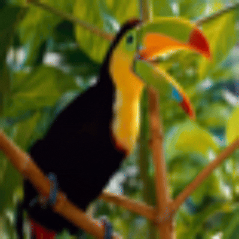
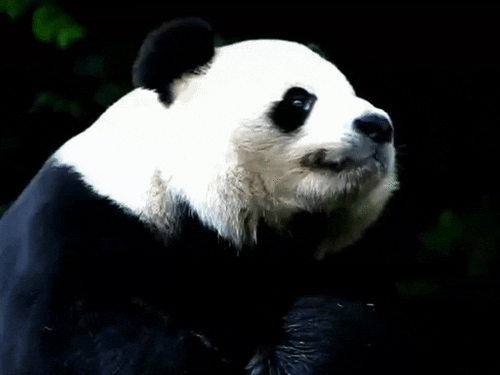
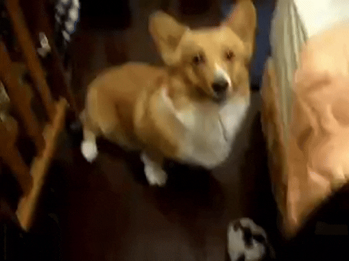
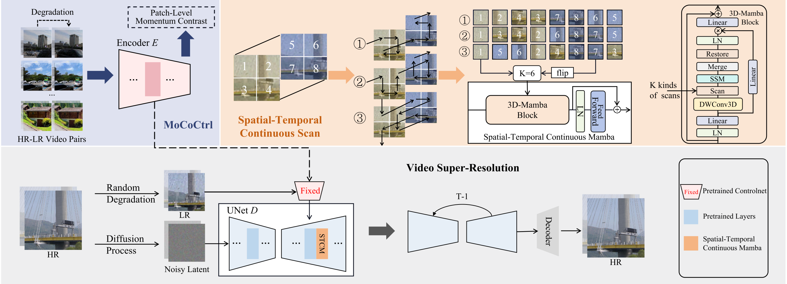

> [Project Integration Note]
> This folder is a vendored copy of the upstream repository `ssj9596/SCST`:
> - Paper: Shi et al., "Self-supervised ControlNet with Spatio-Temporal Mamba for Real-world Video Super-resolution", CVPR 2025
> - Upstream: https://github.com/ssj9596/SCST
> We keep the original code and clearly attribute the source for Part 3 reproduction.

<div align="center">

<h1>
    <br> 
    Self-supervised ControlNet with Spatio-Temporal Mamba for Real-world Video Super-resolution(CVPR2025)
</h1>

Shijun Shi<sup>1*</sup>, Jing Xu<sup>2*</sup>, Lijing Lu<sup>3&dagger;</sup>, Zhihang Li<sup>4&dagger;</sup>, Kai Hu<sup>1</sup>

_<sup>1</sup>Jiangnan University_  
_<sup>2</sup>University of Science and Technology of China_  
_<sup>3</sup>Peking University_ 
_<sup>4</sup>Chinese Academy of Sciences_  

<div>
    <h4 align="center">
        <a href="https://ssj9596.github.io/scst-project/" target='_blank'>
        
        </a>
        <a href="https://arxiv.org/pdf/2506.01037" target='_blank'>
        
        </a>
    </h4>
</div>

</div>


## 🔥 Update
- [2025.04] Training code is released.
- [2025.03] Inference code and checkpoint is released.


## 📈 Our model can do both ISR and VSR. Hope you can enjoy it.
### Realistic Image SR
 

### Realistic Video SR
 


## 🔧 Dependencies and Installation
1. Clone Repo
    ```bash
    git clone https://github.com/ssj9596/SCST.git
    cd SCST
    ```

2. Create Conda Environment and Install Dependencies
    ```bash
    # create new conda env
    conda create -n SCST python=3.10
    conda activate SCST

    # install python dependencies
    pip install -r requirements.txt
    ```

3. Download Models

   - Download pretrained models from [huggingface](https://huggingface.co/MochunniaN1/SCST) and put them under the `checkpoints` folder.
   - Download [SD2.1](https://huggingface.co/stabilityai/stable-diffusion-2-1-base) and put them into ``checkpoints/stable-diffusion-2-1-base``. 

   The [`checkpoints`](./checkpoints) directory structure should be arranged as:

    ```
    ├── checkpoints
    │   ├── controlnet
    │   ├── stable-diffusion-2-1-base
    │   ├── localatten_unet.pth
    │   ├── mococtrl_unet.pth
    │   ├── stcm_unet.pth
    ```

## ☕️ Quick Inference


We provide several examples in the [`inputs`](./inputs) folder. 
Run the following commands to try it out:

```shell
## Single Image 
## no temporal module
python inference/infer_mococtrl.py 
```


```shell
## Video
## use LocalAttention as temporal module
python inference/infer_localatten.py
## use Mamba as temporal module
python inference/infer_stcm.py
```

You can enter the script to modify the input path.


## 🎬 Train A SCST

We divide the training process into several steps to help you reproduce our results from scratch.

1. Download Pretrained Models

    Download **Stable Diffusion 2.1** from [HuggingFace](https://huggingface.co/stabilityai/stable-diffusion-2-1-base) and place it under the `checkpoints/stable-diffusion-2-1-base/` directory
2. Download Training Datasets

    Pre-processed Data (skip Step 3 if using this)
    - [REDS Sub](https://huggingface.co/datasets/MochunniaN1/REDS_sub)
    
    Raw Data (Download original datasets)
    - [REDS (Google Drive)](https://drive.google.com/file/d/1YLksKtMhd2mWyVSkvhDaDLWSc1qYNCz-/view)
    - [YouHQ (Google Drive)](https://drive.google.com/file/d/1f8g8gTHzQq-cKt4s94YQXDwJcdjL59lK/view)

3. Prepare Dataset Format

    We use `.tar` packages of video frames as inputs. Follow the steps below:
    * Use [`dataloader/extract_sub_images.py`](./dataloader/extract_sub_images.py) to crop the high-resolution frames.
    * Pack Each Video Sequence into a `.tar` File and each file contains frame images named `{i%08d}.png`.
    * Prepare the Meta Info File Example ([`datasets_example/reds_meta_info_example.txt`](./datasets_example/reds_meta_info_example.txt)).

    Datasets structure:

    ```
    datasets_example/
    └── REDS/
        ├── 000_s001.tar 
        ├── xxx.tar
        ...
    ```

    Example of reds_meta_info_example.txt:
    ```
    000_s001 40
    ```
    The frames inside the .tar file:
    ```
    000_s001/00000000.png
    ...
    000_s001/00000039.png
    ```
4. Modify Training Scripts and Start Training
    Edit the following parameters in [`train_stage13.py`](./train_stage13.py) and [`train_stage2.py`](./train_stage2.py) to match your data path:
    ```
    meta_path = './datasets_example/reds_meta_info_example.txt'
    hr_root = './datasets_example/REDS/'
    ```
    We provide training scripts for all three stages:
    * Stage 1: [`scripts/stage1.sh`](./scripts/stage1.sh)
    * Stage 2: [`scripts/stage2.sh`](./scripts/stage2.sh)
    * Stage 3 with LocalAttention: [`scripts/stage3_localatten.sh`](./scripts/stage3_localatten.sh)
    * Stage 3 with STCM: [`scripts/stage3_stcm.sh`](./scripts/stage3_stcm.sh)

    To ensure that Stage 2 and Stage 3 use the pre-trained model from the previous stage, make sure to set the `resume_path` parameter accordingly.

## 🎬 Overview



<!-- ## 📑 Citation

   If you find our repo useful for your research, please consider citing our paper:

   ```bibtex
   ``` -->


## Acknowledgments
Our project is based on [diffusers](https://github.com/huggingface/diffusers). Some codes are brought from [MGLD](https://github.com/IanYeung/MGLD-VSR) and [PASD](https://github.com/yangxy/PASD). Thanks for their awesome works.


## 📧 Contact
If you have any questions, please feel free to reach us at `ssj180123@gmail.com`
